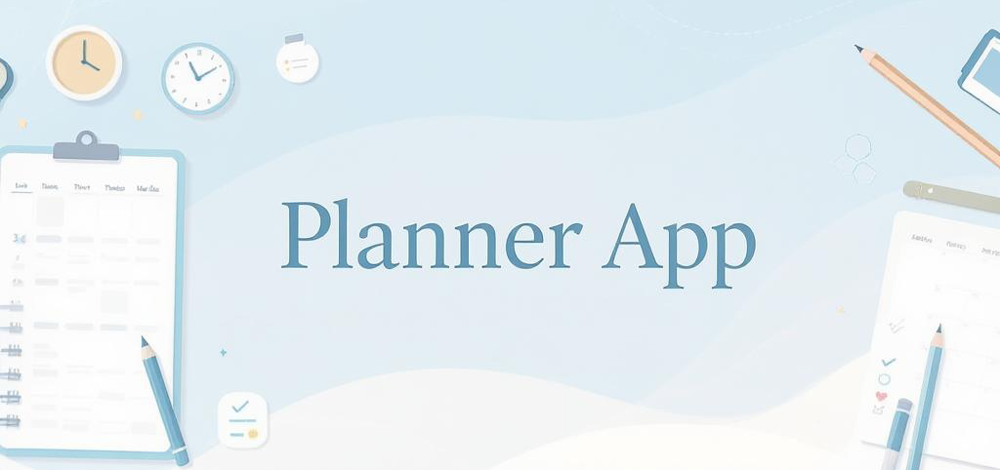

# Planner App

A modern, full-featured personal productivity and planning web application.


---

## Overview

**Planner App** is a productivity dashboard that helps you manage your daily schedule, activities, reminders, projects, and tasks—all with robust timezone support. Designed for efficiency and clarity, it provides a seamless experience for tracking your work, setting reminders, and visualizing your progress.

<video src="https://github.com/arm-on/planner-app/raw/refs/heads/main/demo.mp4" controls></video>

---

## Features

- **Calendar & Schedule:**
  - View and manage your daily, weekly, and monthly activities.
  - Scrollable, interactive calendar UI.
- **Timezone Support:**
  - All activities and reminders are shown in your selected timezone.
  - Change your timezone at any time; all data updates instantly.
- **Activities & Tasks:**
  - Log activities with start/end times, status, and notes.
  - Organize tasks under projects.
- **Reminders:**
  - Set reminders for any date/time in your timezone.
  - Add, edit, and delete reminders instantly (AJAX, no page reload).
- **Projects:**
  - Create and manage projects, each with a custom color.
  - Project badges and names are color-coded throughout the UI.
- **Reports:**
  - Visualize time spent on activities and projects.
  - Filter by date range and timezone.
- **Assistant:**
  - Get productivity tips and help from the built-in assistant.
- **Modern UI:**
  - Responsive, clean dashboard with modals, toasts, and smooth interactions.

---

## Tech Stack

- **Backend:** Python, FastAPI, SQLAlchemy, SQLite
- **Frontend:** HTML, CSS (custom + Bootstrap), JavaScript (vanilla, AJAX)
- **Templating:** Jinja2
- **Other:**
  - Timezone handling: `pytz`, `dateutil`
  - Database: SQLite (file-based, easy to set up)

---

## Setup & Installation

1. **Clone the repository:**
   ```bash
   git clone https://github.com/armanmalekzadeh/planner-app.git
   cd planner-app
   ```

2. **Create a virtual environment (recommended):**
   ```bash
   python3 -m venv planner-app-env
   source planner-app-env/bin/activate
   ```

3. **Install dependencies:**
   ```bash
   pip install -r requirements.txt
   ```

4. **Run the app:**
   ```bash
   python main.py
   ```
   The app will be available at [http://localhost:8000](http://localhost:8000)

5. **Access the dashboard:**
   - Open your browser and go to [http://localhost:8000/dashboard](http://localhost:8000/dashboard)

---

## Usage

- **Register/Login:** Create an account or log in.
- **Set your timezone:** Use the settings to select your preferred timezone.
- **Add activities, tasks, projects, and reminders:** Use the dashboard UI to manage your productivity.
- **View reports:** Analyze your time usage and productivity trends.
- **Use the assistant:** Get help or productivity tips anytime.

---

## Folder Structure

```
planner-app/
  core/           # Core backend logic (database, timezone, user)
  models/         # SQLAlchemy models
  routers/        # FastAPI route handlers
  schemas/        # Pydantic schemas
  static/         # Static files (CSS, JS)
  templates/      # Jinja2 HTML templates
  main.py         # App entry point
  requirements.txt
  test.db         # SQLite database (local)
```

---

## Credits

**Planner App** was created by [Arman Malekzadeh](https://github.com/armanmalekzadeh).

---

## License

This project is licensed under the MIT License. See [LICENSE](LICENSE) for details. 
